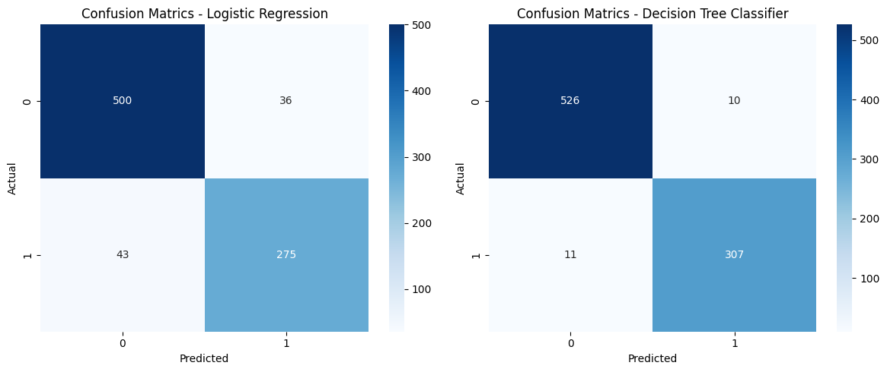

# Loan Approval Prediction

Build models to predict loan approval using the Kaggle Loan Approval Prediction Dataset. We explore the dataset, perform data preprocessing, and apply a comparison between a Logistic Regression Model and a Decision Tree Classifier, along with a winner based on measured performance.

The loan approval dataset is a collection of financial records and associated information used to determine the eligibility of individuals or organizations for obtaining loans from a lending institution. It includes various factors such as CIBIL score, income, employment status, loan term, loan amount, asset value, and loan status. This dataset is commonly used in machine learning and data analysis to develop models and algorithms that predict the likelihood of loan approval based on the given features.

The program also allows users to input their own data and receive a loan approval prediction based on the best performed trained model.

Note: The dataset was originally sourced from Kaggle but used locally to ensure long-term accessibility and avoid internet dependency.

---

## Dataset

The dataset contains information about various features of people who applied for a Loan. Key features include:

- loan_id

- No_of_dependents: Number of Dependents of the Applicant.

- education: Education of the applicant.

- self_employed: Employment Status of the applicant.

- income_annum: Annual income of the applicant.

- loan_amount: Loan Amount.

- loan_term: Loan Term in Years.

- cibil_score: Credit Score.

- residential_assets_value.

- commercial_assets_value.

- luxury_assets_value.

- bank_asset_value.

- loan_status: Final decision of the Loan Approval.

---

## Requirements

This project uses the following Python libraries:

- pandas
- scikit-learn
- matplotlib
- seaborn

Note: To install the required libraries, you can run:

```bash
pip install -r requirements.txt
```

- requirements.txt is included within this directory.

---

## Project Structure 

```plaintext
Project/
├── Loan_Approval.ipynb
├── requirements.txt
├── loan_approval_dataset.csv
└── results.png
```
---

## Steps

1. Data Loading: Load the Loan Approval dataset.

2. Data Exploration: Inspect the first few rows, summary statistics, and check for missing values.

3. Data Preprocessing:
- Handle missing values by filling them with the median.
- One-hot encode the categorical features.
- In this case, 'education' and 'self_employed' features are one-hot encoded using pandas' `get_dummies()`. The 'loan_status' column (Approved/Rejected) was label-encoded as the binary target variable (1 for Approved, 0 for Rejected).

4. Feature Engineering:
- Define the features (X) and the target (y).
- Scale the features using StandardScaler.

5. Model Training:
- Split the data into training and testing sets (80% train, 20% test).
- Train a Logistic Regression model.
- Train a Decision Tree Classifier model.

6. Model Evaluation:
- Evaluate the model using Accuracy Score, Confusion Matrix, Roc Auc Score, and Classification Report.

Notes: 
- Evaluation metrics like Accuracy and ROC AUC help us understand how well the models predict loan approval. 
- The ROC AUC is particularly useful in binary classification problems, as it evaluates the model's performance across all thresholds.
- The Classification Report provides precision, recall, F1-score, and support for each class — useful for evaluating how well the model handles imbalanced or binary classification.


- Print the results.
- Plot the Confusion Matrix of both models with Seaborn.

---

## Code Explanation

- Data Exploration: We explore the dataset to understand its structure and clean it for further analysis.
- Preprocessing: Missing values are handled, and categorical features are one-hot encoded.
- Modeling: A Logistic Regression model and a Decision Tree Classifier model are used to make predictions.
- Evaluation: We evaluate the model's performance with key metrics and visualize the results.

---

## Results

The models were trained and evaluated with the following results:

Logistic Regression Model
- Accuracy: 0.9074941451990632
- ROC AUC: 0.9674094151882099
- Classification Report results

```
          precision    recall  f1-score   support

       0       0.92      0.93      0.93        536
       1       0.88      0.86      0.87        318

accuracy                           0.91       854
macro avg      0.90      0.90      0.90       854
weighted avg   0.91      0.91      0.91       854
```

Decision Tree Classifier Model
- Accuracy: 0.9754098360655737
- ROC AUC: 0.9733760443067679
- Classification Report results

```
          precision    recall  f1-score   support

       0       0.98      0.98      0.98        536
       1       0.97      0.97      0.97        318

accuracy                           0.98       854
macro avg      0.97      0.97      0.97       854
weighted avg   0.98      0.98      0.98       854
```

---

## Data Visualization

The image below shows a side-by-side comparison of the Confusion Matrices for the Logistic Regression and Decision Tree models.



---

## Results and Conclusion

### Model Choice: Decision Tree Classifier

Why the Decision Tree?

- It achieved better evaluation metrics (likely higher accuracy and ROC AUC).
- Handles non-linear relationships and categorical variables more effectively.
- No need for feature scaling (StandardScaler was applied before model training; while it benefits models like Logistic Regression, it has no impact on tree-based models.).

General Strengths of Decision Trees in This Task:
- Can model complex patterns in data (e.g., combinations of income, credit history, etc.).
- Robust to irrelevant features if properly pruned.

---

This project aimed to predict a binary target variable (`loan_status`), representing loan approval (1) or rejection (0). We discovered the Decision Tree Classifier has a better performance than a Logistic Regression model.
Future work can explore more advanced models and techniques to improve prediction accuracy.

---

## How to Run

1. Clone the repository:
```bash
git clone https://github.com/yourusername/loan-approval-prediction.git
```

2. Install dependencies:
```bash
pip install -r requirements.txt
```

3. Open the notebook:
```bash
jupyter notebook Loan_Approval.ipynb
```

---

## User Input

In the final section of the code, users can manually enter the features that describe their financial situation (e.g., income, credit score, assets). The program then outputs a prediction using the **Decision Tree Classifier**, which was selected due to its superior accuracy.

This interactive feature allows users to explore potential loan approval outcomes in real time, based on their individual data.

---

## Future Work

- Incorporate more advanced models such as Random Forests or Gradient Boosting.
- Perform hyperparameter tuning to further optimize model performance.
- Deploy the model with a simple web interface (e.g., using Streamlit or Flask).
- Implement cross-validation for more robust evaluation.

---

## Author

Dennis Alejandro Guerra Calix -- AGCalixto 

